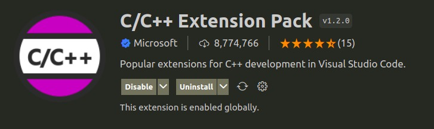
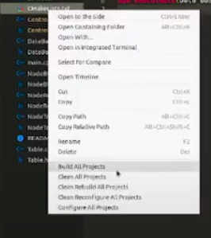

<div id="top"></div>
<!--
*** Thanks for checking out the Best-README-Template. If you have a suggestion
*** that would make this better, please fork the repo and create a pull request
*** or simply open an issue with the tag "enhancement".
*** Don't forget to give the project a star!
*** Thanks again! Now go create something AMAZING! :D
-->


<!-- PROJECT SHIELDS -->
<!--
*** I'm using markdown "reference style" links for readability.
*** Reference links are enclosed in brackets [ ] instead of parentheses ( ).
*** See the bottom of this document for the declaration of the reference variables
*** for contributors-url, forks-url, etc. This is an optional, concise syntax you may use.
*** https://www.markdownguide.org/basic-syntax/#reference-style-links
-->
[![Contributors][contributors-shield]][contributors-url]
[![Forks][forks-shield]][forks-url]
[![Stargazers][stars-shield]][stars-url]
[![Issues][issues-shield]][issues-url]
[![MIT License][license-shield]][license-url]
[![LinkedIn][linkedin-shield]][linkedin-url]


<!-- PROJECT LOGO -->
<br />
<div align="center">
  <a href="https://github.com/AnagabrielaJimenez/Proyecto_Final_ADA_Grupo_4">
    
  </a>

<h3 align="center"> DBMan - Gestor de Base De Datos</h3>

  <p align="center">
    Creación de un Gestor de Base de Datos utilizando estructuras de datos aprendidos en el curso de ADA
        
**Información General de Software**

  </p>
</div>

<!-- ABOUT THE PROJECT -->
## 1. Sobre el Proyecto

<!--[![Product Name Screen Shot][product-screenshot]](https://example.com)-->

DBMan (Data base Managment) es un software creado para la gestión de bases de datos. 
Los sistemas de gestión de base de datos son necesarios e importantes en la creación y gestión de los datos de una organización. 
Almacenan la información de manera organizada y permiten acceder a la información de forma ágil. 

[//]: # (Es por eso que en este informe, presentaremos el desarrollo de un sistema gestor de base de datos. En este caso haremos uso de los temas desarrollados en el curso como la implementación de hashing extensible, el cual es un método de hash dinámico en el que los directorios y los depósitos se utilizan para hacer hash de los datos y también el uso del LRU.)


### 1.1. ¿Qué es un DBMS?
Un sistema gestor de base de datos es un software que permite administrar una base de datos.
Mediante este programa se puede utilizar, configurar y extraer información almacenada. Los usuarios pueden acceder a la información usando herramientas específicas de consulta y de generación de informes, o bien mediante aplicaciones al efecto.


## 2. Objetivos

### 2.1. Objetivo General
Como objetivo principal para nuestro Sistema Gestor de Base de Datos (*DBMan*) es ofrecer comodidad y eficacia al usuario para el almacenamiento de datos variados.

### 2.2. Objetivos Específicos
* Permitir la definición de todos los datos.
* Permitir manipular datos.
* Permitir operaciones, consultas e insertar datos.
* Realizar una adecuada inserción y eliminación de Datos.
* Realizar consultas y operaciones en un tiempo aceptable.

## 3. Estructura de Datos y Algoritmos
### 3.1. Árbol B+
El árbol B+ es un tipo de estructura de datos de árbol, representa una colección de datos ordenados de manera que se permite una inserción y borrado eficientes de elementos. Es un índice, multinivel, dinámico, con un límite máximo 
y mínimo en el número de claves por nodo. Un árbol B+ es una variación de un árbol B.

Se implementó esta estructura para el almacenamiento de los registros de las tablas de las bases de datos. 

```c++
class BPTree {
private:
    NodeBPT *root;
    void insertInternal(int, NodeBPT *, NodeBPT *);
    void removeInternal(int, NodeBPT *, NodeBPT *);
    NodeBPT *findParent(NodeBPT *, NodeBPT *);
    int MAX;
    std::list<int> indexation;
public:
    BPTree(int);
    void search(int);
    void insert(int);
    void remove(int);
    void display(NodeBPT *);
    NodeBPT *getRoot();
    std::list<int> &getIndexation() ;
    void clearIndexation();
};
```


## 4. Instalación 
Para el uso de este software debe tener en consideración los siguientes aspectos:
### 4.1. Requisitos de Software
* Compilador de C++ que soporte el standar C++17. 
* Compilador recomendado: MinGW para Windows y G++ para Linux. 
* Tener instalado Cmake (versión minima 3.16)
* Espacio en disco para la creación de las base de datos
* Se recomienda un Editor de código como Visual Studio Code o IDEs como Clion o Visual Studio.

### 4.2. Plataformas 
El software puede ser ejecutado tanto en las plataformas Linux como Windows.

### 4.3. Dependencias
Para que el software funcione correctamente no es necesaria la instalación de ninguna dependencia adicional.
Solo se usaron las Librerías Estandar de C++.


### 4.4. Instrucciones de instalación
El proyecto puede ser ejecutado tanto en linux como windows. Se puede clonar el repositorio o descargar como ZIP y 
descomprimirlo en la carpeta donde desea crear la base de datos.
Para comenzar la ejecución, úbiquese dentro de la carpeta clonada o descomprimida.

**Compilación y ejecución en LINUX**

Primero, asegúrese de cumplir con el punto *4.1. Requisitos de Software*.
* Si su distribución de GNU/Linux esta basado en Ubuntu y no tiene instalado un compilador de c++ puede seguir estos pasos: 
[Install and Use G++ on Ubuntu](https://linuxhint.com/install-and-use-g-on-ubuntu/).
* Si su distribución de GNU/Linux esta basado en Ubuntu y no tiene instalado CMake puede seguir estos pasos:
[How to Install CMake on Ubuntu](https://vitux.com/how-to-install-cmake-on-ubuntu/).
* Para otras distribuciones, consulte la documentación oficial.

Use la línea de comandos para ubicarse dentro de la carpeta del proyecto y  ejecute las siguientes intrucciones:

1. `mkdir build`
2. `cd build/`
3. `cmake ..`
4. `make`
5. `./Data_Base_Management_System`

**Compilación y ejecución en WINDOWS**

Primero, asegúrese de cumplir con el punto *4.1. Requisitos de Software*.
* Si no tiene instalado un compilador de c++ puede instalarlo siguiendo estos pasos: 
[Instalar MinGW Windows](https://www.solvetic.com/tutoriales/article/9125-instalar-mingw-windows-10/).
* Si no tiene instalado CMake puede instalarlo siguiendo estos pasos:
[Installing CMake](https://cmake.org/install/).

Se recomienda el uso de Visual Studio Code agregando la extensión C/C++ Extension Pack:



A continuación siga los siguientes pasos:
1. Abra la carpeta con Visual Studio Code
2. Dentro de DBMAN, haga clic derecho en *CMakeLists.txt* y escoja la opción *Build All Projects* 




3. Terminado de construir use la terminal para ejecutar los siguientes comandos:

 * `cd "build"`
 * `.\Data_Base_Management_System`

Si trabaja con otro editor de código o IDE consulte su documentación oficial.
### 4.5. Uso

Si ejecutó y compilo correctamente podrá ver las instrucciones 
de uso la linea de comandos o consola como se ve a continuación. 


A partir de aquí sólo siga las instrucciones.

## 5. Documentos Adicionales
* Presentación del proyecto: 
  * [Diapositivas - Presentación de Sofware](https://github.com/AnagabrielaJimenez/Proyecto_Final_ADA_Grupo_4/blob/master/docs/Grupo%204%20-%20Presentaci%C3%B3nSoftwareADA.pdf)
  * [Video en YT - Presentación de Sofware](https://youtu.be/sgWq8B5fOA8)
* Demostración del sofware DBMAN: [Video en YT - Demostración de Sofware DBMAN](https://youtu.be/WXIc_ypRCyc)
* Organización del Repositorio: [Archivo markdown - Organización del Repositorio](https://github.com/AnagabrielaJimenez/Proyecto_Final_ADA_Grupo_4/blob/master/ORGANIZACION_REPOSITORIO.md) 


## 6. Participantes

- Anagabriela Pilar Jiménez López - ajimenezl@unsa.edu.pe

- Jenny Huanca Anquise - jhuancaan@unsa.edu.pe

- Ckaroll Chura Navarro - cchuran@unsa.edu.pe

- Yamil Yonder Llampi Hancco - yllampi@unsa.edu.pe

- Freddy Leonel Humpiri Valdivia - fhumpiri@unsa.edu.pe

Link del repositorio: [https://github.com/AnagabrielaJimenez/Proyecto_Final_ADA_Grupo_4](https://github.com/AnagabrielaJimenez/Proyecto_Final_ADA_Grupo_4)


<!-- LICENCIA -->
## 7. License

Distributed under the MIT License. See `LICENSE.txt` for more information.


<!-- MARKDOWN LINKS & IMAGES -->
<!-- https://www.markdownguide.org/basic-syntax/#reference-style-links -->
[contributors-shield]: https://img.shields.io/github/contributors/AnagabrielaJimenez/Proyecto_Final_ADA_Grupo_4.svg?style=for-the-badge
[contributors-url]: https://github.com/AnagabrielaJimenez/Proyecto_Final_ADA_Grupo_4/graphs/contributors
[forks-shield]: https://img.shields.io/github/forks/AnagabrielaJimenez/Proyecto_Final_ADA_Grupo_4.svg?style=for-the-badge
[forks-url]: https://github.com/AnagabrielaJimenez/Proyecto_Final_ADA_Grupo_4/network/members
[stars-shield]: https://img.shields.io/github/stars/AnagabrielaJimenez/Proyecto_Final_ADA_Grupo_4.svg?style=for-the-badge
[stars-url]: https://github.com/AnagabrielaJimenez/Proyecto_Final_ADA_Grupo_4/stargazers
[issues-shield]: https://img.shields.io/github/issues/AnagabrielaJimenez/Proyecto_Final_ADA_Grupo_4.svg?style=for-the-badge
[issues-url]: https://github.com/AnagabrielaJimenez/Proyecto_Final_ADA_Grupo_4/issues
[license-shield]: https://img.shields.io/github/license/AnagabrielaJimenez/Proyecto_Final_ADA_Grupo_4.svg?style=for-the-badge
[license-url]: https://github.com/AnagabrielaJimenez/Proyecto_Final_ADA_Grupo_4/blob/master/LICENSE.txt
[linkedin-shield]: https://img.shields.io/badge/-LinkedIn-black.svg?style=for-the-badge&logo=linkedin&colorB=555
[linkedin-url]: https://linkedin.com/in/linkedin_AnagabrielaJimenez
[product-screenshot]: images/screenshot.png
